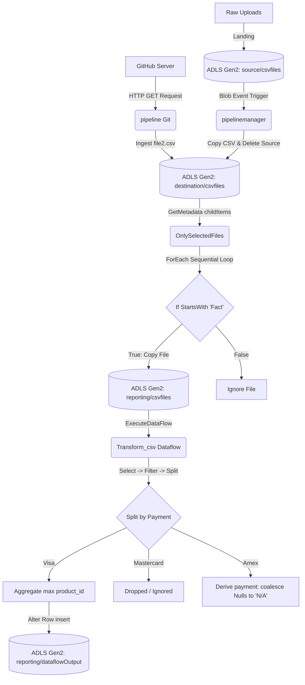

# Reconstructed Azure Data Factory ETL & Orchestration Pipeline
[](https://azure.microsoft.com/en-us/products/data-factory/)
[](https://azure.microsoft.com/en-us/products/storage/data-lake-storage/)
[](https://github.com/)
An end-to-end, metadata-driven data ingestion, staging, and transformation pipeline built entirely inside **Azure Data Factory (ADF) V2** and backed by **Azure Data Lake Storage (ADLS) Gen2**. This project showcases production-level patterns for parameterization, event-driven execution, and visual data transformation.
---
## ⚡ Recruiter Quick-Take (2-Minute Read)
* **What it is:** A serverless Azure ETL system that ingests flat sales/transaction files (from GitHub and local raw landing zones), moves them dynamically based on metadata patterns, cleanses and splits records by payment vendor (Visa, Mastercard, Amex), and aggregates metrics for reporting.
* **Core Skills Shown:** 
  * **Dynamic Orchestration:** Using `Get Metadata`, `ForEach` sequential loops, variables, and `IfCondition` activities to process files dynamically instead of hardcoding paths.
  * **Data Ingestion:** Fetching external public datasets via anonymous HTTP integrations directly into cloud staging layers.
  * **No-Code / Low-Code Transformations:** Designing Mapping Data Flows with column pruning, conditional split routing, null handling, and aggregation.
  * **Event-Driven & Schedule-Based Triggers:** Automating pipeline execution via schedule triggers and Azure Storage Blob Creation events.
* **Current Status:** Azure subscription is deactivated. The repository JSON configurations serve as the sole blueprints to reconstruct the complete system.
---
## 1. Project Overview
This repository houses the complete configuration blueprints (JSON artifacts) for a serverless, multi-zone Azure Data Factory ETL pipeline. It automates:
1. **GitHub Ingestion:** Fetching raw sales datasets directly from GitHub via an HTTP connection.
2. **Raw Landing Zone Monitoring:** Staging files into Azure Data Lake Storage (ADLS) Gen2, archiving raw files on success, and cleaning up source locations.
3. **Metadata-Driven Processing:** Extracting files starting with the prefix `Fact` from staging, forwarding them to a reporting folder, and triggering a Mapping Data Flow.
4. **Conditional Data Transformation:** Parsing transactional records, filtering out specific test customers, splitting entries based on card brands (Visa, Mastercard, Amex), performing aggregations, and exporting to curated storage.
---
## 2. Business Problem
A retail organization receives daily sales transaction records from multiple channels (both external repositories like GitHub and internal raw file landing zones). The incoming data is unstructured or semi-structured, contains incomplete fields, is not filtered for test/bad customer IDs, and needs to be partitioned by payment method for financial audits. 
The company needs a lightweight, low-maintenance pipeline to:
* Automate the movement of files from raw zones to staging zones.
* Archive/delete source files immediately upon successful copy to prevent double processing.
* Dynamically scan and route sales sheets starting with the prefix `Fact` without manual intervention.
* Clean and transform transactions, calculate maximum product sales for Visa transactions, handle null fields for American Express, and store the output in a reporting dashboard zone.
---
## 3. Solution Overview
The solution uses Azure Data Factory (ADF) to orchestrate data movement and transformation across three storage zones in Azure Data Lake Storage Gen2 (ADLS Gen2):
* **Ingestion (Source Zone):** Stores initial raw files (e.g., `Fact_Sales_1.csv`).
* **Staging (Destination Zone):** Receives copies of files from the Source container or directly from GitHub via an HTTP connector.
* **Reporting (Curated Zone):** Receives filtered files matching business criteria and houses the final transformed data output from the Mapping Data Flow.
```
+---------------------------------------+
|  External GitHub / HTTP Repository     |
+-------------------+-------------------+
                    | (pipeline Git)
                    v
+-------------------+-------------------+
|  ADLS Gen2: source Container          | <--- (Blob Event Trigger)
+-------------------+-------------------+
                    | (pipelinemanager)
                    v
+-------------------+-------------------+
|  ADLS Gen2: destination Container     | <--- (Dynamic GetMetadata Loop)
+-------------------+-------------------+
                    | (OnlySelectedFiles)
                    v
+-------------------+-------------------+
|  ADLS Gen2: reporting Container       | <--- (Mapping Data Flow)
+-------------------+-------------------+
                    | (Transform_csv)
                    v
+-------------------+-------------------+
|  ADLS Gen2: dataflowOutput Folder     |
+---------------------------------------+
```
---
## 4. Azure Data Factory Architecture
The pipeline leverages standard Azure components, maintaining a strict distinction between data landing, staging, and reporting containers.

---
## 5. Repository Structure
The project artifacts are structured in the standard Azure Data Factory layout:
```
Data Pipelines/
├── dataflow/
│   └── Transform_csv.json         # Core Mapping Data Flow transformations
├── dataset/
│   ├── CSV_source.json            # ADLS Gen2 Source container (Fact_Sales_1.csv)
│   ├── MetaData.json              # ADLS Gen2 Destination folder schema metadata
│   ├── Sink_csv.json              # ADLS Gen2 Destination folder for general loads
│   ├── dataflow_source.json       # Schema-mapped input dataset for dataflow
│   ├── dataflow_sink.json         # Schema-mapped output dataset for dataflow
│   ├── param_source.json          # Parameterized source file path dataset
│   ├── reporting_sink.json        # Parameterized destination file path dataset
│   ├── source_git.json            # HTTP git location config dataset
│   └── sink_git.json              # ADLS Gen2 destination dataset for git loads
├── factory/
│   └── adfdevanshi.json           # Azure Data Factory resource identifier metadata
├── linkedService/
│   ├── LinkedServices1.json       # ADLS Gen2 Storage Account (storagedevanshi) connection
│   └── Linked_Git.json            # Anonymous HTTP Connector pointing to GitHub
├── pipeline/
│   ├── OnlySelectedFiles.json     # Metadata-driven loop and dataflow trigger pipeline
│   ├── VarPipeline.json           # Variable assignment example pipeline
│   ├── pipeline Git.json          # External Git raw-data pull pipeline
│   └── pipelinemanager.json       # Ingest-and-delete source pipeline
├── trigger/
│   ├── MainTrigger.json           # Event-based Blob Created trigger (Fact_Sales_1.csv)
│   ├── managerTRigger.json        # Event-based Blob Created trigger (Fact_Sales1.csv)
│   └── selectedFilesTrigger.json  # Scheduled 15-minute recurrent pipeline trigger
└── publish_config.json            # Repository deployment config for adf_publish branch
```
---
## 6. Linked Services
Linked Services act as the connection strings for Azure Data Factory. The repository defines two connections:
1. **[LinkedServices1.json](file:///C:/Users/devan/.gemini/antigravity/scratch/My-Data-Pipelines/Data%20Pipelines/linkedService/LinkedServices1.json)**:
   * **Type:** `AzureBlobFS` (Azure Data Lake Storage Gen2)
   * **Endpoint:** `https://storagedevanshi.dfs.core.windows.net/`
   * **Description:** Connects ADF to the primary storage account `storagedevanshi` using encrypted credentials.
2. **[Linked_Git.json](file:///C:/Users/devan/.gemini/antigravity/scratch/My-Data-Pipelines/Data%20Pipelines/linkedService/Linked_Git.json)**:
   * **Type:** `HttpServer` (HTTP connector)
   * **Endpoint:** `https://raw.githubusercontent.com`
   * **Authentication Type:** `Anonymous`
   * **Description:** Connects to public GitHub repositories to extract raw data.
---
## 7. Datasets
Datasets define the schema and exact folder mappings within the storage accounts. 
|
 Dataset 
|
 Linked Service 
|
 Location (Container/Folder/File) 
|
 Schema / Parameters 
|
|
:---
|
:---
|
:---
|
:---
|
|
**
[
CSV_source.json
](
file:///C:/Users/devan/.gemini/antigravity/scratch/My-Data-Pipelines/Data%20Pipelines/dataset/CSV_source.json
)
**
|
`LinkedServices1`
|
`source/csvfiles/Fact_Sales_1.csv`
|
 Delimited Text (Comma separated, header enabled) 
|
|
**
[
Sink_csv.json
](
file:///C:/Users/devan/.gemini/antigravity/scratch/My-Data-Pipelines/Data%20Pipelines/dataset/Sink_csv.json
)
**
|
`LinkedServices1`
|
`destination/csvfiles/`
|
 Delimited Text (Comma separated, header enabled) 
|
|
**
[
MetaData.json
](
file:///C:/Users/devan/.gemini/antigravity/scratch/My-Data-Pipelines/Data%20Pipelines/dataset/MetaData.json
)
**
|
`LinkedServices1`
|
`destination/csvfiles/`
|
 Delimited Text used for structure/childItems auditing 
|
|
**
[
param_source.json
](
file:///C:/Users/devan/.gemini/antigravity/scratch/My-Data-Pipelines/Data%20Pipelines/dataset/param_source.json
)
**
|
`LinkedServices1`
|
`destination/csvfiles/@dataset().p_file_name`
|
**
Parameterized
**
. Takes 
`p_file_name`
 as input 
|
|
**
[
reporting_sink.json
](
file:///C:/Users/devan/.gemini/antigravity/scratch/My-Data-Pipelines/Data%20Pipelines/dataset/reporting_sink.json
)
**
|
`LinkedServices1`
|
`reporting/csvfiles/@dataset().p_file_name`
|
**
Parameterized
**
. Takes 
`p_file_name`
 as input 
|
|
**
[
source_git.json
](
file:///C:/Users/devan/.gemini/antigravity/scratch/My-Data-Pipelines/Data%20Pipelines/dataset/source_git.json
)
**
|
`Linked_Git`
|
 HTTP path: 
`anshlambagit/Azure-Data-Factory/refs/heads/main/Raw%20Data/Fact_Sales_2.csv`
|
 Connects directly to external GitHub user's public file 
|
|
**
[
sink_git.json
](
file:///C:/Users/devan/.gemini/antigravity/scratch/My-Data-Pipelines/Data%20Pipelines/dataset/sink_git.json
)
**
|
`LinkedServices1`
|
`destination/csvfiles/file2.csv`
|
 Delimited Text (Comma separated, header enabled) 
|
|
**
[
dataflow_source.json
](
file:///C:/Users/devan/.gemini/antigravity/scratch/My-Data-Pipelines/Data%20Pipelines/dataset/dataflow_source.json
)
**
|
`LinkedServices1`
|
`reporting/csvfiles/`
|
 Delimited Text with full transaction schema mapping 
|
|
**
[
dataflow_sink.json
](
file:///C:/Users/devan/.gemini/antigravity/scratch/My-Data-Pipelines/Data%20Pipelines/dataset/dataflow_sink.json
)
**
|
`LinkedServices1`
|
`reporting/dataflowOutput/`
|
 Delimited Text output folder 
|
---
## 8. Data Flows
### **[Transform_csv.json](file:///C:/Users/devan/.gemini/antigravity/scratch/My-Data-Pipelines/Data%20Pipelines/dataflow/Transform_csv.json)** (Mapping Data Flow)
This is a visual, no-code data transformation engine that parses incoming CSV transactions and applies row-level operations:
1. **Source (`sourceCSV`):** Reads delimited records from `reporting/csvfiles/` with the following schema:
   * Fields: `transaction_id`, `transactional_date`, `product_id`, `customer_id`, `payment`, `credit_card`, `loyalty_card`, `cost`, `quantity`, `price`.
2. **Select Column (`selectCols`):** Prunes columns to optimize memory. Keeps only:
   * `transaction_id`, `transactional_date`, `product_id`, `customer_id`, `payment`, `price`.
3. **Filter Row (`filter1`):** Removes testing rows where `customer_id == 12` (`customer_id != 12`).
4. **Conditional Split (`split1`):** Evaluates card types:
   * **Visa Branch:** If `payment == 'visa'`.
   * **Mastercard Branch:** If `payment == 'mastercard'` (Dropped in configuration since no sink connects to this branch).
   * **Amex Branch:** Default remaining records.
5. **Derived Column (`derivedColumn`) [Amex Branch]:** Applies a fallback coalesce expression:
   * `payment = coalesce(payment, 'N/A')`
6. **Aggregate (`aggregate1`) [Visa Branch]:** Groups records to identify sales benchmarks:
   * Calculates the maximum `product_id` across Visa transactions: `product_id = max(product_id)`.
7. **Alter Row (`alterRow1`) [Visa Branch]:** Applies a row marker rule to ensure downstream persistence:
   * Sets `insertIf(1==1)` (Mark all records for insertion).
8. **Sink (`sink`):** Writes the aggregated Visa output to `reporting/dataflowOutput/` container with duplicate columns skipped.
---
## 9. Pipelines
Pipelines orchestrate individual activities. There are four distinct pipelines inside this project:
### A. **[pipeline Git.json](file:///C:/Users/devan/.gemini/antigravity/scratch/My-Data-Pipelines/Data%20Pipelines/pipeline/pipeline%20Git.json)**
* **Purpose:** Pulls an external sales file from GitHub.
* **Activities:** 
  * `Copy Git` (Copy Data): Copies `Fact_Sales_2.csv` from public GitHub URL into `destination/csvfiles/file2.csv` on Azure Data Lake Storage.
### B. **[pipelinemanager.json](file:///C:/Users/devan/.gemini/antigravity/scratch/My-Data-Pipelines/Data%20Pipelines/pipeline/pipelinemanager.json)**
* **Purpose:** Move and clean up files dynamically.
* **Activities:**
  * `Copy CSV` (Copy Data): Copies `Fact_Sales_1.csv` from raw `source/csvfiles/` filesystem to staging `destination/csvfiles/` filesystem.
  * `DeleteFile` (Delete Activity): Runs only after `Copy CSV` succeeds. It deletes the source file in `source/csvfiles/Fact_Sales_1.csv` to keep the raw zone clean and avoid reprocessing.
### C. **[VarPipeline.json](file:///C:/Users/devan/.gemini/antigravity/scratch/My-Data-Pipelines/Data%20Pipelines/pipeline/VarPipeline.json)**
* **Purpose:** Demonstrates ADF programming practices by storing folder metadata in an array variable.
* **Activities:**
  * `Get Metadata` (Get Metadata): Audits the directory contents of `destination/csvfiles/` (fetches `childItems`).
  * `StoreFiles` (Set Variable): Populates the pipeline array variable `var_files` with the output of the metadata check: `@activity('Get Metadata').output.childItems`.
### D. **[OnlySelectedFiles.json](file:///C:/Users/devan/.gemini/antigravity/scratch/My-Data-Pipelines/Data%20Pipelines/pipeline/OnlySelectedFiles.json)**
* **Purpose:** The core orchestrator. It checks metadata, runs a sequential filtering loop, copies matching files using parameters, and executes the Mapping Data Flow.
* **Activities:**
  1. `Get Metadata1` (Get Metadata): Queries `destination/csvfiles/` to retrieve all child files.
  2. `ForEachCSV` (ForEach Loop): Iterates sequentially (`"isSequential": true`) over the child files: `@activity('Get Metadata1').output.childItems`.
     * **Inner Loop - `IfFileMatches` (If Condition):** Evaluates if the filename starts with the prefix `"Fact"`: `@startswith(item().name, 'Fact')`.
       * **Inner Loop - `Copy data1` (Copy Data) [If True]:** Passes the loop item name to parameterized datasets to copy matched files from staging (`destination/csvfiles/`) to analytics (`reporting/csvfiles/`).
  3. `Data Transformatiom` (Execute Data Flow): Triggered after the loop succeeds. It executes the Mapping Data Flow `Transform_csv` using a spark compute engine cluster (8 cores).
---
## 10. Trigger Orchestration
To run serverless operations autonomously, the project defines three trigger configurations:
1. **[MainTrigger.json](file:///C:/Users/devan/.gemini/antigravity/scratch/My-Data-Pipelines/Data%20Pipelines/trigger/MainTrigger.json)** (Event-driven, Status: **Active**):
   * **Type:** `BlobEventsTrigger`
   * **Event Type:** `Microsoft.Storage.BlobCreated`
   * **Path Scope:** `/source/blobs/csvfiles/Fact_Sales_1.csv`
   * **Behavior:** Automatically runs `pipelinemanager` the exact millisecond a file is uploaded to the raw landing zone.
2. **[managerTRigger.json](file:///C:/Users/devan/.gemini/antigravity/scratch/My-Data-Pipelines/Data%20Pipelines/trigger/managerTRigger.json)** (Event-driven, Status: **Stopped**):
   * **Type:** `BlobEventsTrigger`
   * **Event Type:** `Microsoft.Storage.BlobCreated`
   * **Path Scope:** `/source/blobs/csvfiles/Fact_Sales1.csv`
   * **Behavior:** A standby trigger mapped to monitor alternative landing file formats.
3. **[selectedFilesTrigger.json](file:///C:/Users/devan/.gemini/antigravity/scratch/My-Data-Pipelines/Data%20Pipelines/trigger/selectedFilesTrigger.json)** (Scheduled, Status: **Active**):
   * **Type:** `ScheduleTrigger`
   * **Recurrence:** Every 15 minutes.
   * **Timezone:** India Standard Time (IST).
   * **Behavior:** Periodically kicks off the `OnlySelectedFiles` orchestrator to run directory checks and transformations.
---
## 11. ETL Workflow
```
+--------------------------------------------------------------------------------------------------+
| Ingestion Phase (Event-Driven)                                                                   |
| 1. A file named 'Fact_Sales_1.csv' lands in ADLS Gen2 'source/csvfiles/'.                         |
| 2. 'MainTrigger' detects the creation event and starts 'pipelinemanager'.                       |
| 3. 'pipelinemanager' copies the file to 'destination/csvfiles/' and deletes it from 'source/'.   |
+--------------------------------------------------------------------------------------------------+
                                                |
                                                v
+--------------------------------------------------------------------------------------------------+
| Orchestration & Staging Phase (Scheduled)                                                        |
| 1. Every 15 minutes, 'selectedFilesTrigger' fires and triggers 'OnlySelectedFiles'.              |
| 2. 'Get Metadata1' reads all filenames under 'destination/csvfiles/'.                             |
| 3. 'ForEachCSV' loops over each file name.                                                       |
| 4. 'IfFileMatches' checks if the name starts with 'Fact'.                                        |
| 5. Matching files are copied to 'reporting/csvfiles/' (renamed dynamically via parameters).     |
+--------------------------------------------------------------------------------------------------+
                                                |
                                                v
+--------------------------------------------------------------------------------------------------+
| Transformation Phase (Compute-Driven)                                                            |
| 1. 'ExecuteDataFlow' starts the 'Transform_csv' mapping data flow.                               |
| 2. Records load from 'reporting/csvfiles/'. Columns are pruned to exclude credit card details.   |
| 3. Customers with ID = 12 are filtered out.                                                      |
| 4. Data splits: Mastercard is dropped; Amex is coalesced for null payments; Visa is aggregated.  |
| 5. Output writes to 'reporting/dataflowOutput/' containing aggregated Visa product analytics.   |
+--------------------------------------------------------------------------------------------------+
```
---
## 12. Screenshots Section
Below are descriptions of the visual configurations inside the Azure Data Factory Studio Canvas:
### A. Pipeline: `OnlySelectedFiles` Orchestrator
Shows the sequential flow starting with a `Get Metadata` activity, linked with a green "Success" constraint path to the `ForEach` loop activity container, which contains the nested `IfCondition` split, and ends with the `Execute Data Flow` activity.
### B. Mapping Data Flow: `Transform_csv`
Shows the visual data flow canvas:
1. `sourceCSV` (Source) box with green header.
2. `selectCols` (Select schema columns) modifier.
3. `filter1` (Filter customer_id != 12) step.
4. `split1` (Conditional Split split into Visa, Mastercard, Amex branches) step showing three outbound flow lines.
5. `derivedColumn` step on the Amex branch, and `aggregate1` (Group-by with max product calculation) step on the Visa branch.
6. `alterRow1` step pointing to the final `sink` (Delimited text destination).
---
## 13. Results
* **Automated Data Processing:** Complete hands-free ingestion and cleaning. Once a file drops into the source container, it moves through staging to reporting without manual intervention.
* **Storage Zone Isolation:** ADLS Gen2 maintains separate containers (`source`, `destination`, `reporting`) representing raw, staged, and gold zones.
* **Security & Cleanliness:** Credit card columns are pruned early during the data flow transformation step to avoid exposing sensitive PII data in reporting outputs. Bad records (test customer 12) are discarded.
* **Filtered Reports:** The Visa output file successfully summarizes product transactional volume by extracting the maximum product ID, formatted as a pipe/comma-separated file.
---
## 14. Key Learnings
* **Parameterization is Crucial:** Passing parameters (`p_file_name`) dynamically from a ForEach loop into source/sink datasets makes pipelines highly reusable.
* **Event-Driven vs. Scheduled Tasks:** Event-driven Blob Event triggers are ideal for light ingestion (immediate raw load), while scheduled triggers are suited for batched downstream transformations to control Spark cluster run-times and compute costs.
* **Clean-up Activities:** Implementing a `Delete` activity immediately following a successful copy prevents duplicate processing and maintains low storage overhead in landing directories.
* **Git Integration in ADF:** Learned how to link a Git repository to ADF, manage configurations locally, and utilize the `adf_publish` branch (via `publish_config.json`) to control release lifecycles.
---
## 15. Future Improvements
* **Azure Key Vault Integration:** Migrate connection endpoints (e.g., ADLS Gen2 URLs) and credentials out of the Linked Service configurations into a central Azure Key Vault for heightened security.
* **Database Target Sinks:** Connect the pipeline output to a relational database (like Azure SQL Database) or a Synapse Analytics table for direct BI dashboard consumption.
* **Diagnostic Alerts:** Add a pipeline failure email notification step using Logic Apps or Webhook activities to alert developers of failing data flows.
* **Parquet/Delta Formats:** Output data to columnar Parquet/Delta formats inside the Mapping Data Flow sink instead of text files to enable faster read speeds for analytics tools.
